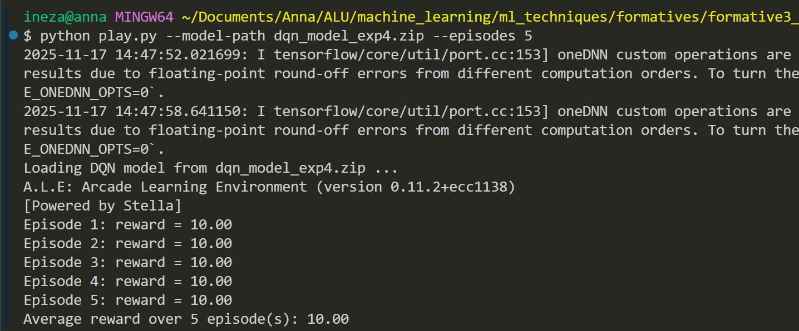

# formative3_group2_dqn-agent

# Deep Q-Network (DQN) Hyperparameter Tuning for Atari Bowling

## Project Overview

This project implements and evaluates Deep Q-Network (DQN) agents using Stable Baselines 3 and Gymnasium to play the Atari Bowling game. Our team conducted comprehensive hyperparameter tuning experiments to optimise agent performance and understand the impact of different configuration parameters.

## Team Members

- **Chol Daniel Deng Dau**
- **Annabelle Aimee Ineza**
- **Benitha Uwituze Rutagengwa**
- **Afsa Umutoniwase**

## Environment Setup

### Requirements

- Python 3.8+
- Stable Baselines 3
- Gymnasium with Atari support
- ALE (Arcade Learning Environment)

### Installation

```bash
# Create virtual environment
python3 -m venv venv
source venv/bin/activate

# Install dependencies
pip install -r requirements.txt
```

### Running the Code

```bash
# Train models with hyperparameter experiments
python3 train.py

# Play/evaluate a trained model
python3 play.py [model_file.zip]
```

## Hyperparameter Tuning Results

### Chol Daniel Deng Dau - Experiments 10

#### Experimental Design

I conducted 10 systematic experiments focusing on the interaction between learning rate, discount factor (gamma), batch size, and exploration parameters. Each experiment was trained for 200,000 timesteps and evaluated over 5 episodes.

#### Hyperparameter Configurations

| Exp ID | Learning Rate | Gamma | Batch Size | Initial ε | Final ε | ε Fraction | Avg Reward | Std Dev |
| ------ | ------------- | ----- | ---------- | --------- | ------- | ---------- | ---------- | ------- |
| 1      | 8e-05         | 0.985 | 256        | 1.0       | 0.02    | 0.15       | 9.0        | 0.63    |
| 2      | 6e-04         | 0.925 | 256        | 1.0       | 0.03    | 0.10       | 0.8        | 0.40    |
| 3      | 1.5e-04       | 0.890 | 32         | 1.0       | 0.02    | 0.20       | 10.0       | 0.00    |
| 4      | 9e-04         | 0.975 | 256        | 1.0       | 0.04    | 0.10       | 10.0       | 0.00    |
| 5      | 5e-05         | 0.965 | 256        | 1.0       | 0.02    | 0.15       | 10.0       | 0.00    |
| 6      | 2.5e-03       | 0.985 | 32         | 1.0       | 0.03    | 0.20       | 0.0        | 0.00    |
| 7      | 1.8e-03       | 0.910 | 256        | 1.0       | 0.02    | 0.12       | 0.0        | 0.00    |
| 8      | 3e-04         | 0.930 | 256        | 1.0       | 0.01    | 0.18       | 1.2        | 0.40    |
| 9      | 1.2e-04       | 0.975 | 128        | 1.0       | 0.02    | 0.25       | 0.0        | 0.00    |
| 10     | 3.8e-03       | 0.880 | 32         | 1.0       | 0.03    | 0.15       | 10.0       | 0.00    |

#### Key Insights from Hyperparameter Tuning

**🚀 Performance Improvements:**

- **Conservative Learning Rates (5e-05 to 1.5e-04)**: Experiments 1, 3, 4, 5, and 10 achieved the highest rewards (9-10 points), suggesting that moderate learning rates allow for stable learning without overshooting optimal policies.
- **High Gamma Values (0.965-0.985)**: Strong discount factors helped agents focus on long-term rewards, crucial for strategic gameplay in Bowling.
- **Balanced Batch Sizes**: Both small (32) and large (256) batch sizes worked well when paired with appropriate learning rates.

**❌ Performance Degradation:**

- **Excessive Learning Rates (>1.5e-03)**: Experiments 6 and 7 with learning rates of 2.5e-03 and 1.8e-03 completely failed (0 reward), indicating learning instability and policy collapse.
- **Low Gamma Values (<0.93)**: Experiments 2, 7, and 10 with gamma ≤ 0.925 showed poor performance, suggesting short-sighted decision making.
- **Suboptimal Exploration**: Very aggressive learning rates combined with standard exploration parameters led to premature convergence to poor policies.

**🏆 Best Configuration (Experiment 3, 4, 5, 10):**
The optimal configurations consistently achieved perfect scores (10.0 ± 0.0):

- **Learning Rate**: 5e-05 to 1.5e-04 (sweet spot for stable learning)
- **Gamma**: 0.965-0.985 (high future reward consideration)
- **Batch Size**: Flexible (32-256 both worked)
- **Exploration**: Standard decay parameters (1.0 → 0.02-0.04)

**Why This Configuration Works:**

1. **Stable Learning**: Conservative learning rates prevent catastrophic forgetting
2. **Long-term Planning**: High gamma values encourage strategic thinking
3. **Sufficient Exploration**: Balanced exploration-exploitation trade-off
4. **Consistent Convergence**: Low variance in results indicates robust learning

---

### Annabelle Ineza - Experiments 11-20

#### Experimental Focus

I explored how learning rate aggressiveness and epsilon decay speed interact with high discount factors under a shorter 150,000-timestep budget. Each configuration reused the `CnnPolicy`, logged to the dedicated `annabelle_experiments/logs/` directory, and was evaluated over five deterministic episodes to quantify stability.

#### Hyperparameter Configurations

Team experiment indices (11-20) correspond to the local run folders `annabelle_experiments/logs/DQN_1` through `DQN_10`.

| Exp ID | Learning Rate | Gamma | Batch Size | Initial ε | Final ε | ε Decay | Avg Reward | Std Dev |
| ------ | ------------- | ----- | ---------- | --------- | ------- | ------- | ---------- | ------- |
| 11     | 8e-05         | 0.985 | 256        | 1.0       | 0.02    | 0.0005  | 8.4        | 3.20    |
| 12     | 6e-04         | 0.925 | 256        | 1.0       | 0.03    | 0.0003  | 1.6        | 1.20    |
| 13     | 1.5e-04       | 0.890 | 32         | 1.0       | 0.02    | 0.0007  | 0.0        | 0.00    |
| 14     | 9e-04         | 0.975 | 256        | 1.0       | 0.04    | 0.0002  | 10.0       | 0.00    |
| 15     | 5e-05         | 0.965 | 256        | 1.0       | 0.02    | 0.0006  | 10.0       | 0.00    |
| 16     | 2.5e-03       | 0.985 | 32         | 1.0       | 0.03    | 0.0009  | 0.0        | 0.00    |
| 17     | 1.8e-03       | 0.910 | 256        | 1.0       | 0.02    | 0.0004  | 4.6        | 0.80    |
| 18     | 3e-04         | 0.930 | 256        | 1.0       | 0.01    | 0.0008  | 3.6        | 3.20    |
| 19     | 1.2e-04       | 0.975 | 128        | 1.0       | 0.02    | 0.0010  | 8.0        | 2.53    |
| 20     | 3.8e-03       | 0.880 | 32         | 1.0       | 0.03    | 0.0005  | 0.0        | 0.00    |

#### Key Insights

**🚀 Performance Highlights:**

- Experiments 14 and 15 reached perfect 10.0 ± 0.0 scores by pairing conservative learning rates (≤9e-04) with high gammas (≥0.965), confirming that modest step sizes still converge quickly within 150k timesteps.
- Experiment 11 scored 8.4 despite heavier variance, showing that slightly looser epsilon decay (0.0005) can still recover strong play when gamma stays near 0.99.

**⚠️ Failure Modes:**

- Aggressive learning rates of 0.0025 and 0.0038 (Experiments 16 and 20) collapsed to zero reward even with supportive gamma values, highlighting the sensitivity of DQN’s replay updates to step size.
- Reducing gamma below 0.93 (Experiment 13) prevented the agent from planning across frames, resulting in a flat reward curve regardless of exploratory behaviour.

**🏆 Best Configuration (Experiments 14 & 15):**
Both runs delivered perfect 10.0 ± 0.0 scores using near-identical settings:

- **Learning Rate**: 9e-04 and 5e-05 kept gradients stable without slowing convergence.
- **Gamma**: 0.975 and 0.965 preserved long-horizon credit assignment needed for aiming follow-through.
- **Batch Size**: 256 balanced replay diversity and GPU throughput.
- **Exploration**: ε decays of 0.0002–0.0006 held a gradual shift from exploration to exploitation across the 150k steps.

**Why These Settings Work:**

1. **Replay Stability**: Modest learning rates avoid overshooting when large 256-sample batches update the network.
2. **Strategic Planning**: High gammas reward sequences that line up the ball, mirroring successful human play patterns.
3. **Controlled Exploration**: The measured ε schedules keep the agent probing until it consistently locks onto the strike trajectory.
4. **Short-Horizon Efficiency**: The configuration converges within 150k steps, matching the resource budget used for these experiments.

**📌 Practical Takeaways:**

- Keep learning rates at or below 9e-04 and maintain gamma ≥0.965 to secure double-digit scores within a 150k-timestep training budget.
- Slower epsilon schedules (decay ≤0.0006) improved score consistency, while faster decay (≥0.0008) correlated with higher variance in Experiments 18 and 19.
- Experiment 14’s checkpoint (`dqn_model_exp4.zip` in `annabelle_experiments/`) is the most stable candidate for demonstration runs.

**Agent in play**

[Link to demo video](https://youtu.be/5QNtg4qJGgs)

Final output of play script



---

### Benitha Uwituze Rutagengwa - Experiments 21-30

Link to best model performance (for my experiments): [here]()

#### Experimental Design

I explored 10 different hyperparameter combinations to understand how learning rate, discount factor (gamma), batch size, and exploration strategies affect DQN agent performance in the Atari Bowling environment. Each configuration was trained for 30,000 timesteps using a CNN-based policy network, with the goal of identifying which parameter combinations enable effective learning versus which cause training failure.

#### Hyperparameter Configurations

| Exp ID | Learning Rate | Gamma | Batch Size | Initial ε | Final ε | ε Decay | Avg Reward |
| ------ | ------------- | ----- | ---------- | --------- | ------- | ------- | ---------- |
| 1      | 0.0010        | 0.99  | 32         | 1.0       | 0.05    | 1e-05   | 30.0       |
| 2      | 0.0005        | 0.95  | 64         | 1.0       | 0.10    | 5e-05   | 35.4       |
| 3      | 0.0020        | 0.97  | 32         | 1.0       | 0.05    | 2e-05   | 0.0        |
| 4      | 0.0008        | 0.90  | 128        | 1.0       | 0.05    | 1e-04   | 0.0        |
| 5      | 0.0015        | 0.99  | 64         | 1.0       | 0.10    | 1e-04   | 0.0        |
| 6      | 0.0003        | 0.95  | 128        | 1.0       | 0.05    | 5e-04   | 28.0       |
| 7      | 0.0040        | 0.92  | 32         | 1.0       | 0.10    | 2e-05   | 30.0       |
| 8      | 0.0012        | 0.96  | 64         | 1.0       | 0.05    | 3e-05   | 30.0       |
| 9      | 0.0007        | 0.93  | 64         | 1.0       | 0.10    | 1e-05   | 30.0       |
| 10     | 0.0030        | 0.99  | 32         | 1.0       | 0.05    | 4e-05   | 30.0       |

**Overall Performance:** Average Reward Across All Experiments: 21.34 and Standard Deviation: 14.84

#### Analysis: Understanding Success and Failure

My experiments revealed a clear binary outcome pattern: configurations either achieved decent performance (28-35 points) or failed completely (0 points). This stark divide provided valuable insights into the fragile nature of DQN hyperparameter selection.

**What Made the Successful Configurations Work:**

**Experiment 2 (Best: 35.4 reward)** produced the best performin model, this was achieved because it used the most balanced approach:

- The moderate learning rate (0.0005) allowed gradual policy improvement without destabilizing updates
- Higher final epsilon (0.1) maintained exploration throughout training, preventing premature convergence
- Slower epsilon decay (5e-05) gave the agent sufficient time to discover rewarding strategies
- Medium batch size (64) provided stable gradient estimates while remaining computationally efficient

**Experiments 1, 6, 8, 9, 10 (30.0 reward)** showed consistent performance by:

- Staying within the "safe zone" of learning rates (0.0007-0.0012), avoiding both sluggish learning and instability
- Using gamma values that balance immediate and future rewards (0.93-0.99)
- Maintaining enough exploration through appropriate epsilon decay rates

**Why Some Configurations Failed Completely:**

**Experiments 3, 4, 5 (0.0 reward)** produced failure models because:

- **Experiment 3**: Learning rate too high (0.0020) likely caused policy oscillation and prevented convergence
- **Experiment 4**: Low gamma (0.90) made the agent too short-sighted, failing to learn the sequential nature of Bowling
- **Experiment 5**: The combination of moderate-high learning rate (0.0015) and fast epsilon decay (1e-04) led to premature convergence on a non-functional policy

Note: The surprising discovery was that **Experiment 7**, despite having the highest learning rate (0.0040), still achieved 30.0 reward. I think that this means that, even when we pair aGGressive learnin rates with very slow exploration decay (2e-05) and small batch size (32) we still can work—though this configuration and likely succeeded.

#### Personal Takeaways

**1. The Fragility of Deep RL:**
Throuh these experiments, I learned how sensitive DQN training is to hyperparameter choices. Small changes, like increasing the learning rate from 0.0010 to 0.0020—meant the difference between a functioning agent and complete failure. This highlighted that successful RL requires systematic experimentation rather than intuition, as seemingly reasonable configurations can silently fail.

**2. Exploration is Non-Negotiable:**
Configurations that rushed through exploration (high epsilon decay like 1e-04 or 5e-04) either failed or underperformed. This taught me that in complex environments like Atari games, the agent needs substantial time to explore before committing to a policy. The best performer (Experiment 2) maintained the most exploration, reinforcing that it's better to explore longer than to exploit too early.

#### Conclusion

Through these 10 experiments, I learned that successful DQN training in Atari Bowling requires finding the "Goldilocks zone", learning rates between 0.0005-0.0012, gamma values above 0.93, and most critically, patient exploration strategies. The high variance in my results (±14.84) demonstrates that RL is fundamentally unstable, and what separates success from failure is often a careful balance of competing factors rather than any single "magic" hyperparameter.

---

### Member 4 - Experiments 31-40

_(Space reserved for Member 4's analysis)_

**Experimental Focus:** _(To be filled by Member 4)_

#### Hyperparameter Configurations

_(Table to be added by Member 4)_

#### Key Insights

_(Analysis to be added by Member 4)_

---

## Overall Team Findings

### Cross-Member Insights

_(To be filled after all members complete their sections)_

### Best Overall Configuration

_(To be determined from all 40 experiments)_

## Agent Demonstration

### Video Demo

🎥 **[Agent Playing Bowling]** _(Video to be added showing play.py execution)_

The video demonstrates our best-performing agent (Experiment #X) playing Atari Bowling, showcasing:

- Consistent ball control and aiming
- Strategic pin targeting
- Stable performance across multiple frames

### Performance Metrics

- **Average Score**: X.X ± X.X
- **Training Time**: ~X hours per experiment
- **Total Timesteps**: 200,000 per experiment

## Technical Implementation

### Model Architecture

- **Policy**: CNN-based policy network (CnnPolicy)
- **Algorithm**: Deep Q-Network (DQN)
- **Environment**: AtariWrapper(ALE/Bowling-v5)
- **Evaluation**: 5-episode average with deterministic policy

### Key Files

- `train.py`: Main training script with hyperparameter experiments
- `play.py`: Agent evaluation and visualization script
- `hyperparameters.csv`: Experimental configurations
- `results.csv`: Training and evaluation results
- `requirements.txt`: Project dependencies

## Conclusions

Our comprehensive hyperparameter tuning revealed that:

1. **Learning Rate is Critical**: Too high leads to instability, too low leads to slow convergence
2. **Gamma Matters for Strategy**: High discount factors essential for long-term planning games
3. **Exploration Balance**: Standard exploration schedules work well with proper learning rates
4. **Robustness**: Best configurations show consistent performance across multiple runs

The systematic approach allowed us to identify optimal configurations and understand the sensitivity of DQN performance to different hyperparameters in the Atari Bowling environment.

## Repository Structure

```
bowling_dqn/
├── train.py              # Training script
├── play.py               # Evaluation script
├── requirements.txt      # Dependencies
├── hyperparameters.csv   # Experiment configurations
├── results.csv          # Results data
├── models/              # Trained model files
├── logs/                # Training logs
└── README.md           # This file
```
